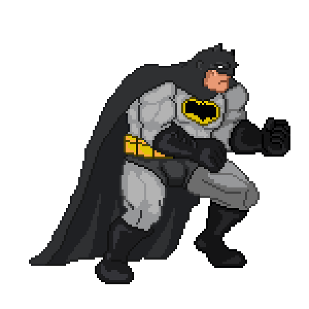
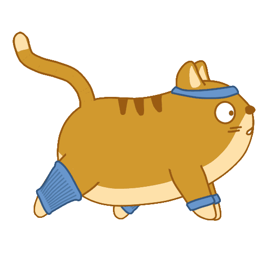

<!--
CREDITS:


@heyoko, @ert, @tenor, @imgur, @pinterest, @szziy, @cheekyrollie,@bigbaddie via Pinterest, Imgur, Giphy for GIFS.

textgnt.com, textgif.com for Animated Text GIFS.

@hayochan, @badgenet, @shieldio for Data Visualisation and Badges.


-->

<!-- header content -->
<div align="center">

</div>
<br/>


<br/>

<!-- connect folder -->
<div align="left">
<details>
  <summary>Connect</summary>
  <br/>
  <p align="left">
  <a href="https://codepen.io/krishlalwani0" target="blank"></a>
  <a href="https://dev.to/krishealty" target="blank"></a>
  <a href="https://stackoverflow.com/users/https://stackoverflow.com/users/20447149/krish-lalwani" target="blank"></a>
  <a href="https://codesandbox.com/krishealty" target="blank"></a>
  <a href="https://dev.to/krishealty" target="blank"></a>
  <a href="https://instagram.com/krishealty" target="blank"></a>
  <a href="https://www.codechef.com/users/krishealty" target="blank"></a>
  </p>
</details>
</div>

<!-- skills folder -->
<div align="left">
<details>
<summary>Skills</summary>
<br/>
<p align="left"> <a href="https://developer.android.com" target="_blank" rel="noreferrer">  </a> <a href="https://angular.io" target="_blank" rel="noreferrer">  </a> <a href="https://aws.amazon.com" target="_blank" rel="noreferrer">  </a> <a href="https://www.blender.org/" target="_blank" rel="noreferrer">  </a> <a href="https://getbootstrap.com" target="_blank" rel="noreferrer">  </a> <a href="https://www.cprogramming.com/" target="_blank" rel="noreferrer">  </a> <a href="https://canvasjs.com" target="_blank" rel="noreferrer">  </a> <a href="https://www.w3schools.com/css/" target="_blank" rel="noreferrer">  </a> <a href="https://firebase.google.com/" target="_blank" rel="noreferrer">  </a> <a href="https://flutter.dev" target="_blank" rel="noreferrer">  </a> <a href="https://git-scm.com/" target="_blank" rel="noreferrer">  </a> <a href="https://www.w3.org/html/" target="_blank" rel="noreferrer">  </a> <a href="https://www.java.com" target="_blank" rel="noreferrer">  </a> <a href="https://developer.mozilla.org/en-US/docs/Web/JavaScript" target="_blank" rel="noreferrer">  </a> <a href="https://kotlinlang.org" target="_blank" rel="noreferrer">  </a> <a href="https://www.linux.org/" target="_blank" rel="noreferrer">  </a> <a href="https://www.microsoft.com/en-us/sql-server" target="_blank" rel="noreferrer">  </a> <a href="https://www.mysql.com/" target="_blank" rel="noreferrer">  </a> <a href="https://nodejs.org" target="_blank" rel="noreferrer">  </a> <a href="https://opencv.org/" target="_blank" rel="noreferrer">  </a> <a href="https://pandas.pydata.org/" target="_blank" rel="noreferrer">  </a> <a href="https://www.php.net" target="_blank" rel="noreferrer">  </a> <a href="https://www.python.org" target="_blank" rel="noreferrer">  </a> <a href="https://pytorch.org/" target="_blank" rel="noreferrer">  </a> <a href="https://reactjs.org/" target="_blank" rel="noreferrer">  </a> <a href="https://reactnative.dev/" target="_blank" rel="noreferrer">  </a> <a href="https://sass-lang.com" target="_blank" rel="noreferrer">  </a> <a href="https://scikit-learn.org/" target="_blank" rel="noreferrer">  </a> <a href="https://www.tensorflow.org" target="_blank" rel="noreferrer">  </a> <a href="https://www.typescriptlang.org/" target="_blank" rel="noreferrer">  </a> <a href="https://unrealengine.com/" target="_blank" rel="noreferrer">  </a> </p>
</details>
</div>

<!-- stats folder -->
<details>
<summary>Stats</summary>
<br/>
<a href="https://status.badgen.net/"></a>
<br/>

<p align="center">
    <a href="https://github.com/krishealty"></a>
	</p>
	<p  align="center">
	  
	</p>
<a href="https://stats.hyochan.dev/en/stats/krishealty"></a>
</details>
<details>
  <summary>About</summary>
  <br/>
  Waddup geeks, I am Krish Lalwani, 18 from India and my life revolves around a small circle of anime, codes, math (i love it sm) and a lot of games. I mainly focus in Machine learning, Cybersecurity, Android studio and Web development while i am still learning Game development and some complex cryptography algorithms as of 2024, since you opened up this About section, below are the fun things that you can try :-P

<br/><br/>
Yes i love doing text art too.

<br/>

```


     |\_/|                  
     | @ @   Woof, GitDog!
     |   <>              _  
     |  _/\------____ ((| |))
     |               `--' |   
 ____|_       ___|   |___.' 
/_/_____/____/_______|


```

<br/><br/>

<div align=center>

Well i love working on making Manga and Anime web designs, graphics and cool stuff from html, css and java in my free time 'cause i love it hehe. Wait, Did i say i love mangas? OH YES I DID!

<br/><br/>
  


Do you wanna play the [Dino game](https://wayou.github.io/t-rex-runner/)?

<br/>

<!-- Spotify Integration -->
[](https://spotify-github-profile.vercel.app/api/view?uid=31nudfj5tl65zml55o2bcaexg3cq&redirect=true)

no dawg I can't code without music—

<br/>


Hit me up on [Instagram](https://instagram.com/krishealty) if you wanna watch some good anime together.

Everything is painful, but do you know what's the most painful thing in the world???

<br/>


Do you love Black Holes??? Oh me too, you can visit my [Pinterest](https://www.pinterest.de/krishealty/extraterrestrial-realm) to check out my enthusiasm towards space.

<br/>

<p align="center">





</p>
<p align="center">
	


</p>
<p align="center">


</p>


<br/>

<details>
<summary>Mind Hypnosis</summary>

	
<br/><br/>

If you've been on this for a while, i bet that you would've experiencing problems while sleeping (average programmer things), while if yes then don't worry pal, i got you. Scroll this tab and watch every GIF for 10 seconds, it'll help you sleep (simple mind altering techniques)
<br/><br/>


</details>

  </div>
</details>
