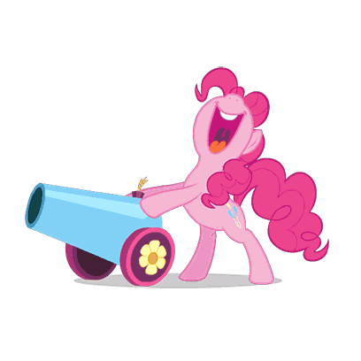
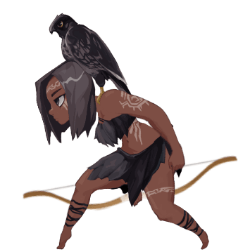
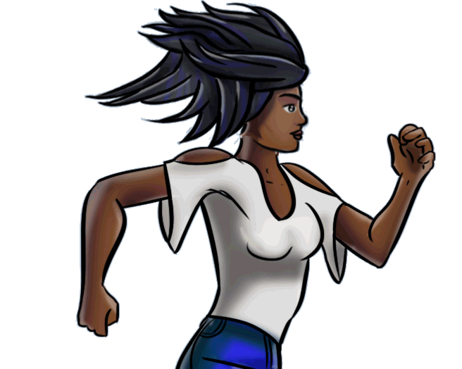
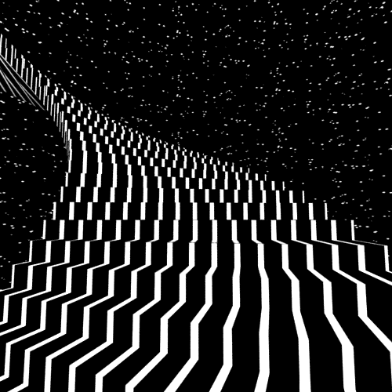

<!--
CREDITS:

@heyoko, @ert, @tenor, @imgur, @pinterest, @szziy, @cheekyrollie, @bigbaddie via Pinterest, Imgur, Giphy for GIFS.

textgnt.com, textgif.com for Animated Text GIFS.

@hayochan, @badgenet, @shieldio for Data Visualisation and Badges.
-->

<!-- header content -->
<div align="center">

</div>
<br/>

<div align="center">

</div>
<br/>
<!-- About Section -->
<details>
  <summary>More</summary>
  <br/>

[](https://git.io/typing-svg)


  Waddup geeks, I am Krish Lalwani, 18 from India and my life revolves around a small circle of anime, codes, math (i love it sm) and a lot of games. I mainly focus in Machine learning, Cybersecurity, Android studio and Web development while i am still learning Game development and some complex cryptography algorithms as of 2024, since you opened up this About section, below are the fun things that you can try :-P

<br/>
<details>
  <summary>Chat Box</summary>
</br>

[](https://git.io/typing-svg)
 
<p align="left">You can discuss about anything in my
  <a href="https://gist.github.com/krishealty/4fe7c331510b167f918ad600083e4827">Chat Box.
  </a>
</p>

</details>

<!-- connect folder -->
<div align="left">
<details>
  <summary>Connect</summary>
  <br/>

[](https://git.io/typing-svg)
 
  <p align="left">
  <a href="https://codepen.io/krishlalwani0" target="blank"></a>
  <a href="https://stackoverflow.com/users/https://stackoverflow.com/users/20447149/krish-lalwani" target="blank"></a>
  <a href="https://codesandbox.com/krishealty" target="blank"></a>
  <a href="https://dev.to/krishealty" target="blank"></a>
  <a href="https://instagram.com/krishealty" target="blank"></a>
  <a href="https://www.codechef.com/users/krishealty" target="blank"></a>
  </p>
</details>
</div>

<!-- skills folder -->
<div align="left">
<details>
<summary>Skills</summary>
<br/>

[](https://git.io/typing-svg)

[](https://skillicons.dev)

</details>
</div>
<br/>

```


     |\_/|                  
     | @ @   Woof, GitDog!
     |   <>              _  
     |  _/\------____ ((| |))
     |               `--' |   
 ____|_       ___|   |___.' 
/_/_____/____/_______|


```

<br/> 


Do you wanna play the [Dino game](https://krishealty.github.io/T-Rex-runner/)?

<br/>

<details>
<summary>GIFs</summary>
<br/>
<div align=center>

Well i love working on making Manga and Anime web designs, graphics and cool stuff from html, css and java in my free time 'cause i love it hehe. Wait, Did i say i love mangas? OH YES I DID!
<br/>


Hit me up on [Instagram](https://instagram.com/krishealty) if you wanna watch some good anime together.

Everything is painful, but do you know what's the most painful thing in the world???

<br/>


Do you love Black Holes??? Oh me too, you can visit my [Pinterest](https://www.pinterest.de/krishealty/extraterrestrial-realm) to check out my enthusiasm towards space.

<br/>
<p align="center">

</p>
<p align="center">

</p>
<p align="center">






</p>
<p align="center">


</p>

<p align="center">

	


</p>
<p align="center">


</p>
<p align="center">


</p>
<p align="center">

</p>
<p align="center">

</p>

<br/>

<details>
<summary>Mind Hypnosis</summary>

	
<br/><br/>

If you've been on this for a while, i bet that you would've experiencing problems while sleeping (average programmer things), well if yes then don't worry pal, i got you. Scroll this tab and watch every GIF for 10 seconds, it'll help you sleep (simple mind altering techniques)
<br/><br/>





</details>
  </div>

[](https://github.com/piyushsuthar/github-readme-quotes)

</details>
</details>

<!-- stats folder -->
<details>
<summary>Stats</summary>
</br>

[](https://git.io/typing-svg)
 
<!--  -->
<table width="2000">
<tr>
<td width="2000"></td>
</tr>
</table>
<!-- 


 -->

<table>
<tr>
<td></td>
<td></td>
</tr>
</table>

<table width="2000">
<tr>
<td width="2000"></td>
<td width="1000">
<a href="https://stats.hyochan.dev/en/stats/krishealty"></a>
</td>
</tr>
</table>
<table>
<tr>
<td width="1000">
<a href="https://status.badgen.net/"></a>
<br/>

<p align="center">
    <a href="https://github.com/krishealty"></a>
	</p>
</td>
</tr>
</table>

<table>
<tr>
<td><a href="https://info.flagcounter.com/C3bA"></a></td>
<td>
<a href="https://info.flagcounter.com/vpP9"></a>
</td>
</tr>
</table>

  trophies, verify [here.](https://learn.microsoft.com/en-us/users/me/achievements?tab=tab-learning-paths#trophies-section)
<table>
<tr>
<td width="60"></td>
<td width="60"></td>
<td width="60"></td>
<td width="60"></td>
<td width="60"></td>
<td width="60"></td>
<td width="60"></td>
<td width="60"></td>
</tr>
<tr>
<td width="60"></td>
<td width="60"></td>
<td width="60"></td>
<td width="60"></td>
<td width="60"></td>
<td width="60"></td>
<td width="60"></td>
<td width="60"></td>
</tr>
<tr>
<td width="60"></td>
<td width="60"></td>
<td width="60"></td>
<td width="60"></td>
<td width="60"></td>
<td width="60"></td>
<td width="60"></td>
<td width="60"></td>
</tr>
<tr>
<td width="60"></td>
<td width="60"></td>
<td width="60"></td>
<td width="60"></td>
<td width="60"></td>
<td width="60"></td>
<td width="60"></td>
<td width="60"></td>
</tr>
</table>
<table>
<td>


</td>
</table>
</details>

View [simplified.](https://github.com/krishealty/krishealty/blob/main/SIMPLE.md)
